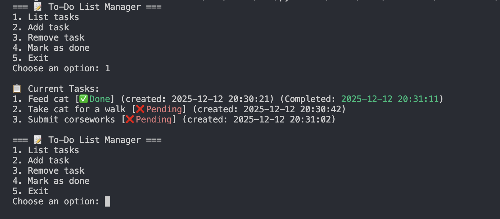

# 📝 Python CLI To-Do List Manager

A simple **command-line to-do list application** built with Python.  
Tasks are stored locally in a JSON file and persist between runs.

This project demonstrates core Python concepts such as file I/O, data structures, program flow, and basic project organization.

---

## 📂 Features

- List all tasks with status (Pending / Done)
- Add new tasks
- Remove tasks
- Mark tasks as completed
- Automatically tracks:
  - Task creation time
  - Task completion time
- Color-coded status output in the terminal
- Persistent storage using JSON

---

## 📂 Project Structure

```
todo-cli/
├── main.py # Application entry point & menu
├── tasks.py # Task-related operations
├── storage.py # Load/save tasks from JSON
├── utils.py # Helper functions
├── user_tasks.json # Auto-generated task storage
└── README.md
```
---
## Getting Started

### Requirements
- Python 3.7+
- `colorama`

### Run the application
```
python main.py
```

When you run the app, you’ll see:
```
=== 📝 To-Do List Manager ===
1. List tasks
2. Add task
3. Remove task
4. Mark as done
5. Exit
```
Follow the prompts to manage your tasks!!

## 📂 Example Output




## 📂 Possible Improvements
- Task priorities or due dates
- Edit existing tasks
- Search/filter tasks
- UI design

## 📜 License
This project is for learning and personal use.